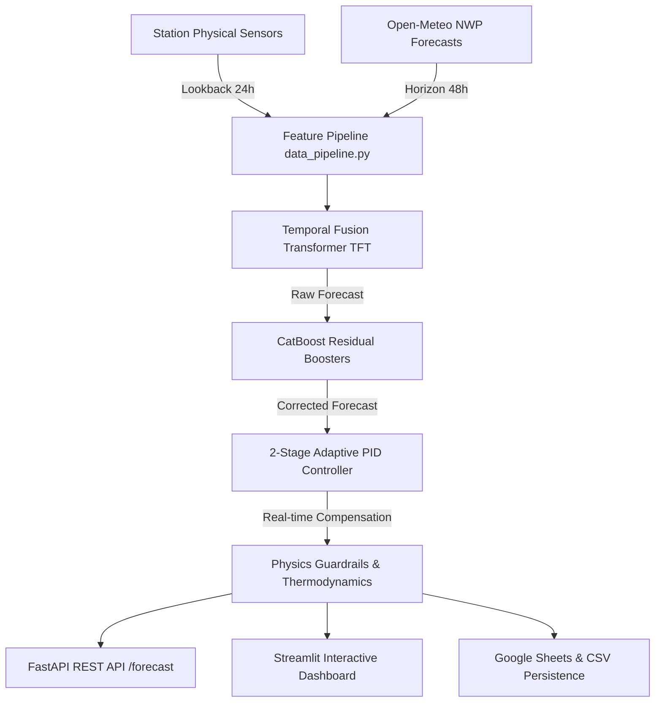

# Hyperlocal Weather Forecasting Pipeline

Production-grade hybrid AI system for hyperlocal 48-hour weather forecasting. Combines a deep **Temporal Fusion Transformer (TFT)** neural network with **CatBoost Residual Boosters**, a standalone **Precipitation Classifier**, and an **Adaptive 2-Stage PID Controller** with physical thermodynamics guardrails (Magnus-Tetens, Inversion, Solar Zenith).

---

## 🌟 Key Architecture & Highlights



1. **Temporal Fusion Transformer (TFT)**:
   - Interpretable Multi-Head Self-Attention + Variable Selection Networks (VSN).
   - Homoscedastic uncertainty loss balancing 12 meteorological targets (temperature, humidity, pressure, wind, UV, rain, lux, PM particles).
2. **CatBoost Residual Boosting**:
   - Horizon-segmented gradient boosted trees correcting multi-step systematic NWP and TFT errors.
3. **Dedicated Precipitation Classifier**:
   - CatBoost classifier with isotonic probability calibration and smooth thermodynamic humidity/dew point guardrails.
4. **Adaptive 2-Stage PID Controller**:
   - Live closed-loop feedback controller with bumpless gain transfer and barometric pressure trend ($dP/dt$) front detection.
5. **Thermodynamics & Physical Constraints**:
   - Magnus-Tetens saturation vapor pressure coupling, nocturnal temperature inversion correction, solar peak thermal boost, and phase change constraints.

---

## 🚀 Quick Start

### 1. Installation
```bash
# Clone the repository
git clone https://github.com/your-username/weather-forecast-pipeline.git
cd weather-forecast-pipeline

# Install required dependencies
pip install -r requirements.txt
```

### 2. Full Pipeline Execution
To execute the end-to-end pipeline (Data Ingestion $\rightarrow$ Feature Engineering $\rightarrow$ Model Training $\rightarrow$ Verification):
```bash
python main.py run-all
```

---

## 🛠️ Master CLI Commands (`main.py`)

The pipeline provides a unified CLI orchestrator:

| Command | Description | Example Usage |
|---|---|---|
| `run-all` | Full end-to-end pipeline execution | `python main.py run-all --epochs 30 --days 14` |
| `collect` | Ingest sensor streams & Open-Meteo forecasts | `python main.py collect --source all --days 14` |
| `features` | Generate thermodynamic & lag features | `python main.py features` |
| `train` | Train TFT, CatBoost Residuals, Rain, & PID | `python main.py train --epochs 30 --batch_size 64` |
| `serve` | Launch FastAPI REST API server | `python main.py serve --host 127.0.0.1 --port 8000` |
| `dashboard` | Launch Streamlit web dashboard | `python main.py dashboard --port 8501` |
| `benchmark` | Offline accuracy benchmarking against NWP | `python main.py benchmark` |

---

## 🌐 API & Web Dashboard

### FastAPI Backend (`src/app.py`)
```bash
python main.py serve
```
- **Interactive Swagger Docs**: `http://127.0.0.1:8000/docs`
- **Health Check**: `GET /health`
- **Station List**: `GET /stations`
- **48h Forecast Endpoint**: `GET /forecast/{station_id}`

### Streamlit Dashboard (`src/dashboard.py`)
```bash
python main.py dashboard
```
- **Interactive Station Map**: Live station statuses and geographical locations.
- **Forecast Charts**: Multi-variable charts with 15-min, 1-hour, and 6-hour granularity.
- **Blind Backtest Tab**: Rolling historical backtesting with horizon-sliced MAE/RMSE/Bias metrics and Component Impact analysis (TFT vs CatBoost vs PID).

---

## 📁 Repository Structure

```
weather-forecast-pipeline/
├── main.py                     # Master CLI Orchestrator
├── requirements.txt            # Python dependencies
├── .gitignore                  # Git hygiene rules
├── config/
│   ├── settings.json           # Central pipeline hyperparameter config
│   ├── stations.json           # Station geographical metadata & IDs
│   ├── scalers.json            # Normalization scale parameters
│   └── pid_params.json         # Calibrated station PID coefficients
├── src/
│   ├── project_paths.py        # Centralized repository path resolution
│   ├── data_fetcher.py         # ClimateNet sensor & Open-Meteo forecast fetcher
│   ├── data_pipeline.py        # Physical feature engineering & dataset preparation
│   ├── inversion.py            # Nocturnal thermal inversion calculations
│   ├── model.py                # Temporal Fusion Transformer PyTorch architecture
│   ├── train.py                # TFT training pipeline with uncertainty loss
│   ├── residual_engine.py      # CatBoost multi-horizon error correction engine
│   ├── rain_engine.py          # Dedicated rain classification & physics guardrails
│   ├── pid_tuner.py            # 2-Stage PID dynamic error compensation tuner
│   ├── backtest_engine.py      # Historical rolling blind backtesting engine
│   ├── evaluate.py             # Offline accuracy evaluation against NWP baselines
│   ├── app.py                  # FastAPI inference REST API service
│   └── dashboard.py            # Streamlit interactive user interface
├── tests/
│   ├── backtest_vs_actuals.py  # 2-month multi-station blind backtest script
│   ├── forecast_saver.py       # Hourly automated forecast collector
│   └── sheets_writer.py        # Google Sheets live sync client
└── models/                     # Trained binary model weights (.gitkeep)
```

---

## 🧪 Testing & Verification

Run tests and accuracy benchmarks:
```bash
# Run 2-month blind backtest
python tests/backtest_vs_actuals.py

# Evaluate offline metrics
python main.py benchmark

# Automated forecast saving cycle (single test run)
python tests/forecast_saver.py --once
```

---

## 📄 License
MIT License. Developed for high-precision hyperlocal meteorological forecasting.
